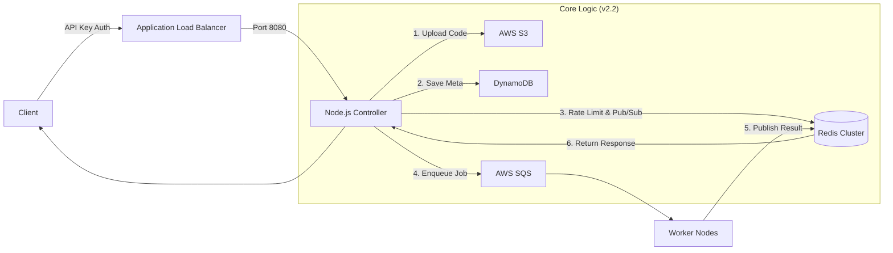

# ⚡ NanoGrid: High-Density FaaS Controller

NanoGrid는 AWS EC2 기반의 초경량 FaaS(Function as a Service) 플랫폼입니다. Lambda의 콜드 스타트 비용 없이, Redis와 SQS를 활용한 비동기 아키텍처로 높은 처리량과 안정성을 보장합니다.

## 🏗 Architecture Overview

NanoGrid는 Event-Driven Architecture를 기반으로 설계되었습니다.



## ✨ Key Features

### 🛡️ 1. Advanced Security
- **API Key Authentication**: x-api-key 헤더 검증
- **Atomic Rate Limiting**: Redis Lua Script 기반
- **Safe Input Handling**: NoSQL Injection 방지

### 🏥 2. Operational Stability
- **Fail-Fast** 환경변수 검증
- **Graceful Shutdown** 안전 종료
- **Smart Health Check** Redis 상태 기반

### 🔭 3. Observability
- **Structured JSON Logging**
- **Traceable Request ID (UUID)**

## 🚀 Getting Started

### Prerequisites
- Node.js v16+
- Redis
- AWS Credentials

### Installation
```bash
git clone https://github.com/your-repo/nanogrid-controller.git
cd nanogrid-controller
npm install
```

### Configuration (.env)
```
PORT=8080
AWS_REGION=ap-northeast-2
BUCKET_NAME=nanogrid-code-bucket
TABLE_NAME=NanoGridFunctions
SQS_URL=https://sqs.ap-northeast-2.amazonaws.com/xxx/nanogrid-queue
REDIS_HOST=nanogrid-redis.xxxx.cache.amazonaws.com
NANOGRID_API_KEY=your-secret-api-key-1234
```

### Run Server
```bash
pm2 start controller.js --name "controller"
# dev mode
node controller.js
```

## 📡 API Reference

### 1. Code Upload
```
POST /upload
Header: x-api-key
multipart/form-data
```

### 2. Run Function
```
POST /run
{
  "functionId": "uuid-string",
  "inputData": { "name": "NanoGrid" }
}
```

### 3. Health Check
```
GET /health
200 OK / 503 Service Unavailable
```

## 🛠 Project Structure
```
nanogrid-controller/
├── controller.js
├── client.py
├── package.json
└── .env
```

## 👨‍💻 Client Automation
```bash
python client.py main.py
python client.py
```